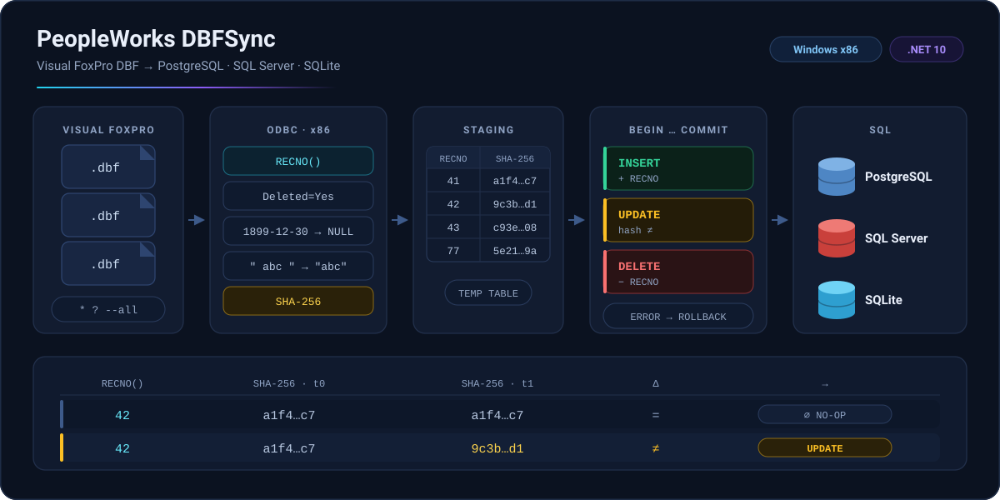

<div align="center">

# PeopleWorks DBFSync

[](https://github.com/peopleworks/DBFSync/actions/workflows/ci.yml)
[](LICENSE)
[](https://github.com/peopleworks/DBFSync/stargazers)


**Español** · [English](README.en.md)

**CLI de .NET 10 para migrar y sincronizar DBF de Visual FoxPro hacia PostgreSQL,
SQL Server o SQLite, sin apagar el ERP.** El sistema Xbase++ continúa operando
sobre sus DBF mientras otros servicios consumen una base relacional actualizada.



<sub><code>RECNO()</code> conserva la identidad física del registro y <code>SHA-256</code>
decide si cambió; cada tabla se reconcilia en su propia transacción.</sub>

</div>

PeopleWorks DBFSync ofrece perfiles de conexión seguros, selección flexible con
wildcards, detección de cambios por contenido, evolución controlada del esquema,
ejecución desatendida y una terminal bilingüe basada en Spectre.Console.

> **Plataforma:** Windows `win-x86`. El proceso debe ser de 32 bits porque el
> Microsoft Visual FoxPro ODBC Driver es x86.

## Contenido

- [Características](#características)
- [Cómo funciona](#cómo-funciona)
- [Requisitos e instalación](#requisitos-e-instalación)
- [Inicio rápido con SQLite](#inicio-rápido-con-sqlite)
- [Perfiles y seguridad](#perfiles-y-seguridad)
- [Referencia de comandos](#referencia-de-comandos)
- [Selección de DBF](#selección-de-dbf)
- [Migración y sincronización](#migración-y-sincronización)
- [Evolución del esquema](#evolución-del-esquema)
- [Mapeo de tipos](#mapeo-de-tipos)
- [Task Scheduler](#task-scheduler)
- [Logs y códigos de salida](#logs-y-códigos-de-salida)
- [Troubleshooting](#troubleshooting)
- [Desarrollo y contribuciones](#desarrollo-y-contribuciones)
- [Proyectos PeopleWorks relacionados](#proyectos-peopleworks-relacionados)

## Características

| Área | Capacidades |
|---|---|
| Destinos | PostgreSQL, SQL Server y SQLite |
| Selección | Nombre exacto, listas, `*`, `?`, `--all`, exclusiones y opciones repetidas |
| Identidad | `RECNO()` conserva la identidad física de cada registro DBF |
| Cambios | SHA-256 detecta modificaciones aunque el `RECNO()` no cambie |
| Reconciliación | Inserta nuevos, actualiza modificados y elimina ausentes o marcados como borrados |
| Esquema | Agrega campos, amplía tipos seguros, bloquea cambios destructivos y permite reconstrucción explícita |
| Seguridad | Perfiles nombrados, contraseñas protegidas con DPAPI y transporte cifrado por defecto |
| Automatización | Sin credenciales en argumentos, logs por ejecución y bloqueo de trabajos simultáneos |
| Idiomas | Recursos extensibles en inglés y español |
| Experiencia CLI | Banner PeopleWorks, colores, tablas y contexto de conexión sin revelar secretos |

## Cómo funciona

```text
DBF de Visual FoxPro
        │
        ▼
ODBC x86 ── RECNO() + normalización + SHA-256
        │
        ▼
Tabla temporal de staging
        │
        ▼
Transacción por tabla
        │
        ├── INSERT de registros nuevos
        ├── UPDATE cuando cambia el hash
        └── DELETE de registros ausentes
        │
        ▼
PostgreSQL / SQL Server / SQLite
```

- El driver se abre con `Deleted=Yes`; los registros marcados como borrados no
  se transfieren y desaparecen del destino durante `sync`.
- Las fechas vacías de FoxPro (`1899-12-30`) se normalizan como `NULL`.
- Los textos se normalizan antes de calcular el hash.
- Cada DBF tiene su propia transacción. Si se seleccionan varias tablas y una
  posterior falla, las anteriores ya confirmadas permanecen sincronizadas.
- Los nombres destino se normalizan a minúsculas y DBFSync agrega
  `_dbfsync_recno`, `_dbfsync_hash` y `_dbfsync_at`.

## Requisitos e instalación

### Requisitos

- Windows con el **runtime .NET 10 x86** o el SDK .NET 10.
- Microsoft Visual FoxPro ODBC Driver **x86**.
- Lectura sobre la carpeta que contiene los DBF.
- Para PostgreSQL o SQL Server: permiso para conectar, crear el esquema y crear
  o modificar tablas.
- Para SQLite: escritura sobre la carpeta del archivo `.db`.
- Para `--create-database`: permiso para crear bases desde `postgres` en
  PostgreSQL o `master` en SQL Server.

### Compilar desde el código fuente

```powershell
dotnet restore .\DBFSync.slnx
dotnet build .\DBFSync.slnx --configuration Release
dotnet test .\DBFSync.slnx --configuration Release
dotnet publish .\src\DBFSync\DBFSync.csproj `
  --configuration Release `
  --runtime win-x86 `
  --self-contained false `
  --output .\dist\win-x86
```

Verifique el ejecutable:

```powershell
.\dist\win-x86\dbfsync.exe --version
.\dist\win-x86\dbfsync.exe --help --lang es
```

Puede copiar todo el contenido de `dist\win-x86` a una carpeta estable, por
ejemplo `C:\Tools\PeopleWorks\DBFSync`. No copie únicamente `dbfsync.exe`; las
DLL y los recursos publicados también son necesarios.

## Inicio rápido con SQLite

SQLite no requiere servidor ni credenciales y es el destino recomendado para
la primera prueba desatendida.

```powershell
# 1. Crear el perfil y el archivo SQLite
dbfsync profile set local `
  --engine sqlite `
  --file C:\DBFSync\erp.db

# 2. Revisar qué se leerá
dbfsync inspect `
  --source C:\ERP\Datos `
  --tables "clientes,articulos,fa*.dbf" `
  --exclude "*hist*,*bak*"

# 3. Carga inicial
dbfsync migrate `
  --profile local `
  --source C:\ERP\Datos `
  --tables "clientes,articulos,fa*.dbf"

# 4. Sincronizaciones posteriores
dbfsync sync `
  --profile local `
  --source C:\ERP\Datos `
  --tables "clientes,articulos,fa*.dbf" `
  --sync-schema
```

El archivo y sus carpetas padre se crean automáticamente.

## Perfiles y seguridad

Los perfiles se guardan por nombre en:

```text
C:\ProgramData\PeopleWorks\DBFSync\profiles.json
```

Los logs se escriben en:

```text
C:\ProgramData\PeopleWorks\DBFSync\logs
```

`DBFSYNC_HOME` permite cambiar ambas ubicaciones:

```powershell
$env:DBFSYNC_HOME = "D:\PeopleWorks\DBFSync"
dbfsync profile list
```

Las contraseñas nunca se guardan en texto plano. DPAPI las protege con uno de
estos ámbitos:

| Ámbito | Uso recomendado | Consideración |
|---|---|---|
| `--scope user` | Ejecución manual o tarea con la misma cuenta Windows | Solo esa cuenta puede descifrar la contraseña |
| `--scope machine` | Servicio o tarea con otra cuenta de la misma máquina | Proteja `profiles.json` con permisos NTFS restrictivos |

SQLite y la autenticación integrada de SQL Server no almacenan contraseña.
Para modificar un perfil, ejecute nuevamente `profile set` con el mismo nombre
y todas sus opciones.

### PostgreSQL con SSL verificado

El transporte cifrado está habilitado de forma predeterminada. En PostgreSQL se
valida tanto el certificado como el nombre del servidor.

```powershell
dbfsync profile set erp-pg `
  --engine postgresql `
  --server pg01.example.com `
  --port 5432 `
  --database erp `
  --schema public `
  --user dbfsync `
  --scope user `
  --create-database
```

La contraseña se solicita una sola vez y el perfil se prueba antes de guardarlo.

### PostgreSQL local sin SSL

Algunas instalaciones locales no habilitan SSL. En un equipo de desarrollo
confiable use explícitamente `--no-encrypt`:

```powershell
dbfsync profile set erp-pg `
  --engine postgresql `
  --server 127.0.0.1 `
  --port 5432 `
  --database pwerp `
  --schema public `
  --user postgres `
  --scope user `
  --no-encrypt `
  --create-database
```

Después puede confirmar la conexión:

```powershell
dbfsync profile test erp-pg
```

> `--trust-server-certificate` mantiene SSL pero omite la validación del
> certificado. No resuelve un servidor que no ofrece SSL; para ese caso local se
> necesita `--no-encrypt`. No desactive el cifrado en redes no confiables o en
> producción.

### SQL Server con usuario

```powershell
dbfsync profile set erp-sql `
  --engine sqlserver `
  --server sql01 `
  --port 1433 `
  --database ERP `
  --schema dbo `
  --user dbfsync `
  --scope machine `
  --trust-server-certificate `
  --create-database
```

SQL Server también cifra de forma predeterminada. Use
`--trust-server-certificate` únicamente cuando el servidor use un certificado
confiable para la organización pero no validable por la máquina cliente.

### SQL Server con autenticación de Windows

```powershell
dbfsync profile set erp-windows `
  --engine sqlserver `
  --server sql01 `
  --database ERP `
  --schema dbo `
  --integrated
```

### SQLite

```powershell
dbfsync profile set local `
  --engine sqlite `
  --file C:\DBFSync\erp.db
```

SQLite usa WAL, espera ocupada y un archivo lateral `.dbfsync.lock` para impedir
dos escritores DBFSync simultáneos sobre la misma base. Los decimales se guardan
como texto canónico de cultura invariable para conservar precisión exacta; las
fechas y marcas de tiempo se guardan como texto ISO.

### Administración de perfiles

```powershell
dbfsync profile list
dbfsync profile show erp-pg
dbfsync profile test erp-pg
dbfsync profile remove erp-pg
```

### Creación de bases

`--create-database` crea la base si no existe antes de verificar y guardar el
perfil. También existe una operación idempotente para perfiles guardados:

```powershell
dbfsync database create --profile erp-pg
```

- PostgreSQL conecta a la base de mantenimiento `postgres`.
- SQL Server conecta a `master`.
- SQLite crea el archivo y sus carpetas padre.
- Si la base ya existe, el comando termina correctamente sin recrearla.

## Referencia de comandos

| Comando | Descripción |
|---|---|
| `dbfsync --help` | Muestra ayuda resumida |
| `dbfsync --version` | Muestra la versión |
| `dbfsync sample` | Muestra escenarios completos |
| `dbfsync profile set NAME` | Crea o reemplaza un perfil |
| `dbfsync profile list` | Lista perfiles |
| `dbfsync profile show NAME` | Muestra un perfil sin secretos |
| `dbfsync profile test NAME` | Prueba la conexión |
| `dbfsync profile remove NAME` | Elimina un perfil |
| `dbfsync database create --profile NAME` | Crea o verifica la base |
| `dbfsync inspect ...` | Inspecciona esquema, filas activas y muestra |
| `dbfsync migrate ...` | Reemplaza el contenido destino |
| `dbfsync sync ...` | Reconcilia inserciones, cambios y eliminaciones |

También se aceptan aliases en español como `perfil`, `migrar`, `sincronizar`,
`inspeccionar`, `ejemplo` y `ayuda`.

### Opciones de `profile set`

| Opción | Motores | Descripción |
|---|---|---|
| `--engine postgresql\|sqlserver\|sqlite` | Todos | Motor requerido |
| `--server HOST` | PostgreSQL, SQL Server | Servidor o dirección IP |
| `--port N` | PostgreSQL, SQL Server | Puerto; PostgreSQL usa 5432 si se omite |
| `--database NAME` | PostgreSQL, SQL Server | Base de datos |
| `--file PATH` | SQLite | Archivo de base SQLite |
| `--schema NAME` | PostgreSQL, SQL Server | Predeterminado: `public` o `dbo` |
| `--user NAME` | PostgreSQL, SQL Server | Usuario cuando no se usa autenticación integrada |
| `--integrated` | SQL Server | Usa la identidad Windows del proceso |
| `--scope user\|machine` | PostgreSQL, SQL Server | Ámbito DPAPI; predeterminado: `user` |
| `--no-encrypt` | PostgreSQL, SQL Server | PostgreSQL desactiva SSL y SQL Server deja de exigir cifrado; solo desarrollo local confiable |
| `--trust-server-certificate` | PostgreSQL, SQL Server | Mantiene cifrado sin validar certificado |
| `--password-stdin` | PostgreSQL, SQL Server | Lee una línea desde stdin en vez de preguntar |
| `--create-database` | Todos | Crea la base o archivo si no existe |

### Opciones de transferencia

| Opción | Descripción |
|---|---|
| `--profile NAME` | Perfil destino requerido |
| `--source PATH` | Carpeta DBF requerida |
| `--tables PATTERNS` | Lista de nombres o patrones separados por coma |
| `--table PATTERN` | Patrón individual; puede repetirse |
| `--all` | Selecciona todos los DBF de la carpeta |
| `--exclude PATTERNS` | Excluye nombres o patrones |
| `--batch-size N` | Filas por lote; predeterminado 5000, rango 1-100000 |
| `--sync-schema` | Aplica evolución estructural segura |
| `--allow-drop-columns` | Autoriza eliminar columnas; exige `--sync-schema` |
| `--recreate` | Reconstruye tablas; solo `migrate` |

`--all` y patrones de inclusión son mutuamente excluyentes.

### Idioma

`--lang` puede aparecer en cualquier posición:

```powershell
dbfsync --help --lang es
dbfsync sample --lang en
dbfsync inspect --lang es --source C:\ERP\Datos --tables "fa*.dbf"
```

Para una tarea programada también puede usar `DBFSYNC_LANG`:

```powershell
$env:DBFSYNC_LANG = "es"
```

## Selección de DBF

La búsqueda se realiza sobre los archivos `.dbf` de la carpeta indicada, sin
recorrer subcarpetas.

| Necesidad | Ejemplo |
|---|---|
| Un DBF | `--table clientes` |
| Lista | `--tables clientes,articulos` |
| Opciones repetidas | `--table clientes --table articulos` |
| Prefijo | `--tables "fa*.dbf"` |
| Un carácter | `--tables "cbmovf??"` |
| Exclusión | `--exclude "*hist*,*bak*"` |
| Negación inline | `--tables "fa*,!fahist*"` |
| Todos salvo algunos | `--all --exclude "temp*,*bak*,prueba*"` |

Cada patrón de inclusión debe encontrar al menos un DBF y la selección final no
puede quedar vacía. Esto evita que una tarea termine silenciosamente por un
nombre mal escrito.

Antes de escribir, use `inspect`:

```powershell
dbfsync inspect `
  --source C:\ERP\Datos `
  --tables "fa*.dbf,cbmovf??" `
  --exclude "*hist*,*bak*"
```

## Migración y sincronización

### Carga inicial

`migrate` reemplaza todo el contenido de las tablas seleccionadas:

```powershell
dbfsync migrate `
  --profile erp-pg `
  --source C:\ERP\Datos `
  --tables "clientes,articulos,fa*.dbf"
```

### Sincronización recurrente

```powershell
dbfsync sync `
  --profile erp-pg `
  --source C:\ERP\Datos `
  --tables "clientes,articulos,fa*.dbf" `
  --exclude "*hist*"
```

En cada tabla:

1. `RECNO()` identifica el registro físico.
2. SHA-256 representa todos los valores normalizados.
3. Un `RECNO()` nuevo produce `INSERT`.
4. El mismo `RECNO()` con otro hash produce `UPDATE`.
5. Un `RECNO()` ausente produce `DELETE`.

Así, cambiar cualquier campo se sincroniza aunque el `RECNO()` permanezca igual.

### Implementación por motor

| Motor | Staging y reconciliación | Bloqueo |
|---|---|---|
| PostgreSQL | `COPY` binario y transacción | Advisory lock por tabla |
| SQL Server | `SqlBulkCopy` y transacción | `sp_getapplock` por tabla |
| SQLite | Tabla temporal y UPSERT transaccional | Archivo exclusivo por base |

## Evolución del esquema

Sin indicadores de esquema, una tabla existente debe coincidir exactamente con
el DBF. Si cambió, DBFSync se detiene antes de reconciliar datos.

### Agregar campos o ampliar tipos

```powershell
dbfsync sync `
  --profile erp-pg `
  --source C:\ERP\Datos `
  --tables clientes,articulos `
  --sync-schema
```

`--sync-schema`:

- agrega campos nuevos como columnas anulables;
- amplía longitudes de texto compatibles;
- amplía precisión/escala decimal conservando capacidad;
- permite `date` a fecha/hora cuando corresponde;
- aplica estructura y datos en la misma transacción por tabla.

### Eliminar campos

Los campos que desaparecieron del DBF se rechazan de forma predeterminada:

```powershell
dbfsync sync `
  --profile erp-pg `
  --source C:\ERP\Datos `
  --tables clientes `
  --sync-schema `
  --allow-drop-columns
```

`--allow-drop-columns` es destructivo y exige `--sync-schema`.

### Cambios incompatibles

Una reducción de longitud o precisión y cualquier conversión insegura requieren
reconstrucción:

```powershell
dbfsync migrate `
  --profile erp-pg `
  --source C:\ERP\Datos `
  --tables clientes `
  --recreate
```

`--recreate` elimina y vuelve a crear la tabla dentro de una transacción. Solo
se admite con `migrate` y no se combina con `--sync-schema`.

## Mapeo de tipos

| Tipo DBF | SQL Server | PostgreSQL | SQLite |
|---|---|---|---|
| Texto | `nvarchar(n)` / `nvarchar(max)` | `varchar(n)` / `text` | `TEXT` |
| Decimal | `decimal(p,s)` | `numeric(p,s)` | `TEXT` canónico exacto |
| Entero | `bigint` | `bigint` | `INTEGER` |
| Punto flotante | `float(53)` | `double precision` | `REAL` |
| Lógico | `bit` | `boolean` | `INTEGER` |
| Fecha | `date` | `date` | `TEXT` ISO |
| Fecha/hora | `datetime2(3)` | `timestamp without time zone` | `TEXT` ISO |
| Binario | `varbinary(max)` | `bytea` | `BLOB` |

SQLite no codifica longitud ni precisión en el tipo físico. Por eso
`--sync-schema` agrega o elimina columnas allí, pero no necesita ampliar esos
atributos.

## Task Scheduler

La tarea solo recibe el nombre del perfil; nunca necesita la contraseña:

```text
C:\Tools\PeopleWorks\DBFSync\dbfsync.exe sync --profile erp-pg --source C:\ERP\Datos --tables "fa*.dbf,cbmovf??" --exclude "*hist*" --lang es
```

Ejemplo de creación con PowerShell:

```powershell
$action = New-ScheduledTaskAction `
  -Execute "C:\Tools\PeopleWorks\DBFSync\dbfsync.exe" `
  -Argument 'sync --profile erp-pg --source C:\ERP\Datos --tables "fa*.dbf,cbmovf??" --exclude "*hist*" --lang es'

$trigger = New-ScheduledTaskTrigger `
  -Once `
  -At (Get-Date).AddMinutes(1) `
  -RepetitionInterval (New-TimeSpan -Minutes 5)

$settings = New-ScheduledTaskSettingsSet `
  -MultipleInstances IgnoreNew `
  -StartWhenAvailable

Register-ScheduledTask `
  -TaskName "PeopleWorks DBFSync ERP" `
  -Action $action `
  -Trigger $trigger `
  -Settings $settings `
  -Description "Sincroniza DBF del ERP con PostgreSQL"
```

- Con `--scope user`, la tarea debe ejecutarse con la misma cuenta que creó el
  perfil.
- Con `--scope machine`, limite el acceso NTFS a la carpeta de configuración.
- Configure **no iniciar una instancia nueva** si la anterior sigue activa.
- Trate únicamente el código `0` como éxito.

## Logs y códigos de salida

Cada `migrate` y `sync` crea un log UTF-8 con marcas UTC:

```text
C:\ProgramData\PeopleWorks\DBFSync\logs\
yyyyMMdd-HHmmssfff-operacion-perfil-pid.log
```

| Código | Significado |
|---|---|
| `0` | Ejecución correcta |
| `1` | Argumentos inválidos, error de conexión o transferencia |
| `130` | Cancelación con Ctrl+C |

Los logs contienen progreso, conteos y errores, pero no contraseñas.

## Troubleshooting

### `SSL connection requested. No SSL enabled connection from this host is configured`

El perfil solicita SSL y el PostgreSQL local no lo ofrece. Vuelva a guardar el
mismo perfil completo agregando `--no-encrypt`:

```powershell
dbfsync profile set erp-pg `
  --engine postgresql `
  --server 127.0.0.1 `
  --port 5432 `
  --database pwerp `
  --schema public `
  --user postgres `
  --scope user `
  --no-encrypt
```

Use esta opción solo en desarrollo local confiable. Si el servidor ofrece SSL
con un certificado no validable, use `--trust-server-certificate` en lugar de
desactivar el cifrado.

### `Unknown options: --no-encryp`

La opción correcta lleva `t` final: `--no-encrypt`.

### No se puede abrir el DBF

Confirme que:

1. está instalado el **Microsoft Visual FoxPro ODBC Driver x86**;
2. está ejecutando el artefacto `win-x86`;
3. la cuenta tiene lectura sobre la carpeta;
4. ningún proceso abrió el DBF de forma exclusiva.

### No se puede descifrar la contraseña DPAPI

- `--scope user`: ejecute con la misma cuenta Windows que creó el perfil.
- `--scope machine`: el perfil debe haberse creado en esa misma máquina.
- Si cambió de equipo o cuenta, vuelva a guardar el perfil.

### La base no se puede crear

El usuario necesita `CREATEDB` en PostgreSQL o permiso `CREATE ANY DATABASE` en
SQL Server. También puede crear la base manualmente y guardar el perfil sin
`--create-database`.

### El esquema cambió

- Cambio compatible: repita con `--sync-schema`.
- Campo eliminado: agregue conscientemente `--allow-drop-columns`.
- Cambio incompatible: use `migrate --recreate` después de confirmar que puede
  reconstruir la tabla.

### Un wildcard no encuentra archivos

Cada patrón de inclusión debe coincidir. Use `inspect`, verifique la carpeta y
recuerde que la búsqueda no recorre subdirectorios.

### Otra ejecución está sincronizando

Espere a que termine la ejecución existente. Revise Task Scheduler para impedir
instancias paralelas; no elimine el archivo de bloqueo SQLite mientras haya un
proceso activo.

## Desarrollo y contribuciones

### Estructura

```text
DBFSync.slnx
├── src
│   ├── DBFSync.Core   Lectura DBF, perfiles y motores destino
│   └── DBFSync        Aplicación CLI y presentación
├── tests
│   └── DBFSync.Core.Tests
├── .github
│   └── workflows
│       └── ci.yml     Build, pruebas, auditoría y artefacto win-x86
├── assets
│   └── hero.svg       Diagrama del flujo de sincronización
├── README.md
├── README.en.md
└── LICENSE
```

Dependencias principales:

- `System.Data.Odbc` para Visual FoxPro;
- `Npgsql` para PostgreSQL;
- `Microsoft.Data.SqlClient` para SQL Server;
- `Microsoft.Data.Sqlite` y SQLitePCLRaw para SQLite;
- `Spectre.Console` para la terminal.

### Pruebas y auditoría

```powershell
dotnet test .\DBFSync.slnx --configuration Release
dotnet list .\DBFSync.slnx package --vulnerable --include-transitive
```

Las pruebas cubren hashing, perfiles, selección, localización, mapeo de tipos,
compatibilidad estructural y el ciclo integral de SQLite.

### CI en GitHub Actions

El repositorio incluye [`.github/workflows/ci.yml`](.github/workflows/ci.yml),
que corre sobre `windows-latest` en cada push y cada pull request hacia `main`,
y también a demanda con `workflow_dispatch`:

| Paso | Qué hace |
|---|---|
| `dotnet restore` y `dotnet build` | Compila la solución completa en `Release` |
| `dotnet test` | Ejecuta la suite de pruebas |
| `dotnet list package --vulnerable` | Falla la ejecución si aparece una dependencia vulnerable |
| `dotnet publish` | Genera el binario `win-x86` dependiente del framework |
| `actions/upload-artifact` | Publica `dist/win-x86` como artefacto descargable |

El runner estándar no incluye el driver Visual FoxPro; las pruebas DBF
end-to-end necesitan un runner Windows propio que lo tenga instalado. En los
runners de GitHub, la superficie portable de validación son las pruebas
unitarias y el ciclo integral de SQLite.

### Agregar un idioma

Copie:

```text
src\DBFSync.Core\Resources\Strings.es.resx
```

como `Strings.<cultura>.resx`, por ejemplo `Strings.pt.resx`, y traduzca solo
los valores. Inglés es el recurso neutral.

Las contribuciones deben mantener los tres motores consistentes, incluir pruebas
para cambios de comportamiento y no registrar secretos ni datos del ERP.

## Proyectos PeopleWorks relacionados

DBFSync es una de las tres herramientas de datos de PeopleWorks. Cada una
resuelve una etapa distinta de una modernización y las tres son CLI de .NET
publicadas bajo licencia MIT.

| | [DBFSync](https://github.com/peopleworks/DBFSync) | [SQLDiff](https://github.com/peopleworks/SqlSchemaDiff) | [SyncJob](https://github.com/peopleworks/syncjob) |
|---|---|---|---|
| **Propósito** | Migrar y sincronizar datos heredados | Comparar y alinear esquemas | Sincronizar datos relacionales de forma continua |
| **Origen** | DBF de Visual FoxPro vía ODBC x86 | Esquema de SQL Server | SQL Server |
| **Destino** | PostgreSQL, SQL Server o SQLite | Script `ALTER` que preserva los datos | SQL Server |
| **Modelo de seguridad** | Transacción por tabla, cambios detectados por SHA-256 y cambios de esquema destructivos bloqueados | Aplicación transaccional y detección de drift con código de salida `2` para CI | Ejecución desatendida como CLI o como servicio de Windows |
| **Ejecución** | CLI, Windows `win-x86`, .NET 10 | CLI de binario único, .NET 9 | CLI y servicio de Windows, .NET |

Las tres se encadenan en una modernización gradual:

1. **SQLDiff** deja el esquema relacional en el estado esperado y detecta el
   drift entre entornos antes de tocar los datos.
2. **DBFSync** carga los DBF de Visual FoxPro sobre ese esquema y los mantiene
   sincronizados mientras el ERP heredado sigue en producción.
3. **SyncJob** mueve esos datos ya relacionales hacia los demás sistemas de SQL
   Server que los consumen.

---

## Créditos

Creado por **Pedro Hernández — PeopleWorks**
· [GitHub](https://github.com/pedrohernandez-xari)
· [Microsoft MVP for .NET](https://mvp.microsoft.com/en-US/mvp/profile/24060a02-dbc6-44ec-bca5-c213ff9835c5)

Construido para las comunidades de .NET, Visual FoxPro y modernización de datos:
*por y para la comunidad de desarrolladores.*

DBFSync forma parte de la práctica de datos de **PeopleWorks Services, LLC &
Xari Technologies**, junto a
[DPO — Data Performance Optimizer](https://dpo.peopleworksservices.com/), la
plataforma de evaluación, optimización y gobierno multi-base.

### Participar

| | |
|---|---|
| Repositorio | <https://github.com/peopleworks/DBFSync> |
| Reportes y propuestas | [Issues](https://github.com/peopleworks/DBFSync/issues) |
| Contribuciones | [Pull requests](https://github.com/peopleworks/DBFSync/pulls) |

Si DBFSync le sirvió en una migración real, abra un issue contando el escenario:
los casos concretos de ERP son lo que hace avanzar los tres motores. Un pull
request con pruebas, una traducción nueva o una estrella también ayudan.

Distribuido bajo la [licencia MIT](LICENSE).

<p align="center">
  <sub><b>PeopleWorks DBFSync</b> • Sincronización de datos Visual FoxPro para sistemas reales</sub><br>
  <sub><b>PeopleWorks data tools</b> —
  <b>DBFSync</b> conecta DBF con bases modernas ·
  <a href="https://github.com/peopleworks/SqlSchemaDiff">SQLDiff</a> alinea esquemas ·
  <a href="https://github.com/peopleworks/syncjob">SyncJob</a> mueve datos relacionales</sub>
</p>
